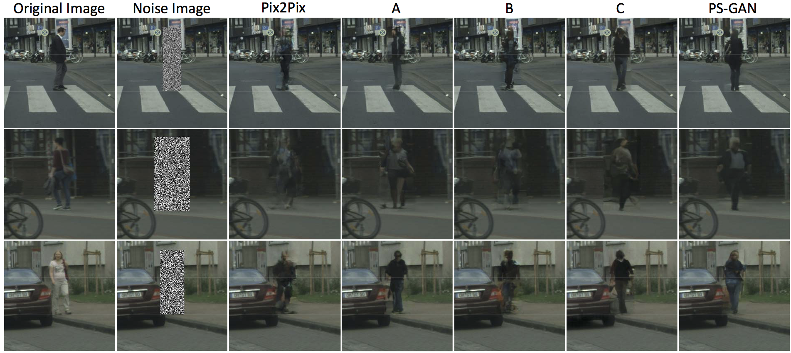
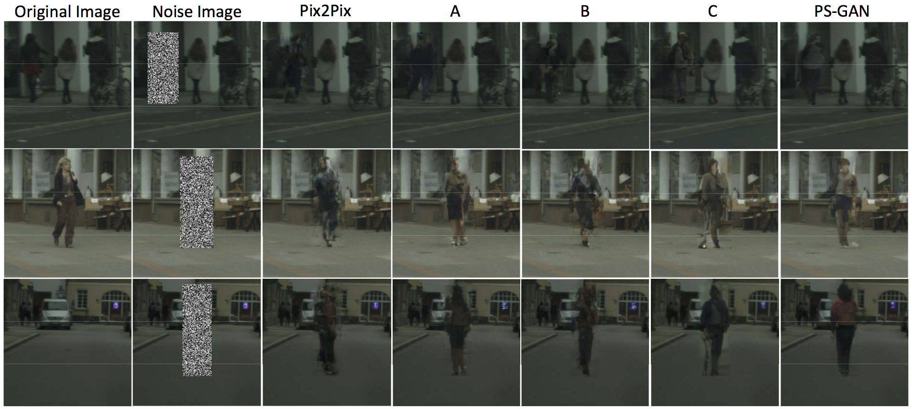
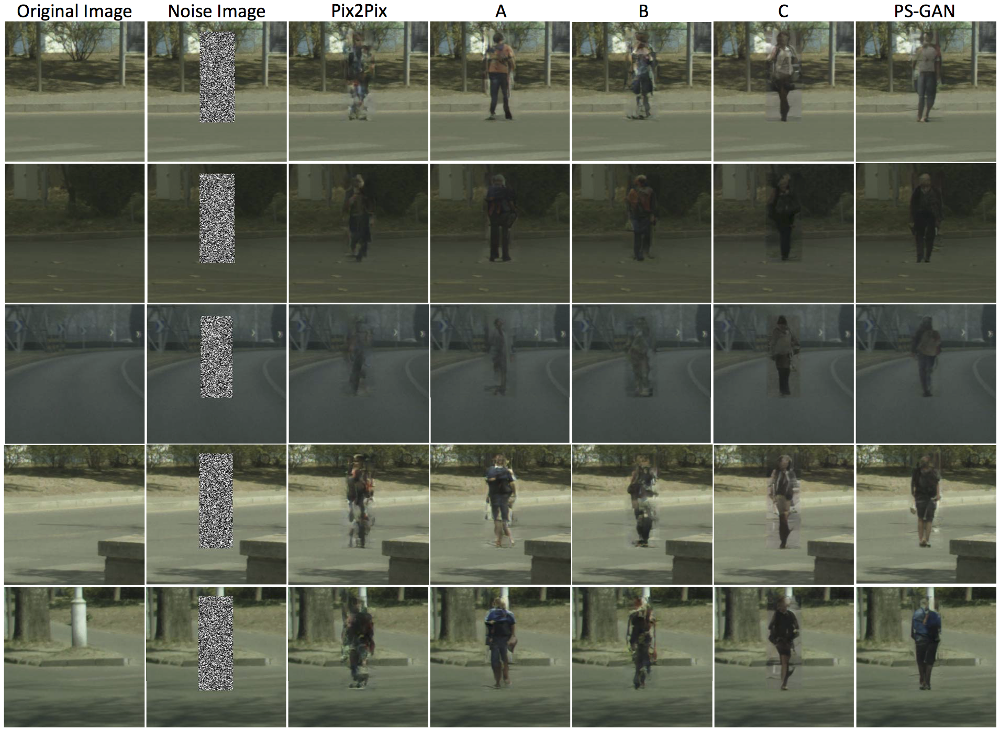

# Pedestrian-Synthesis-GAN
See arxiv: https://arxiv.org/abs/1804.02047
</br>
Pedestrian-Synthesis-GAN: Generating Pedestrian Data in Real Scene and Beyond
</img>
</br></br></br>

## Preparing
Prepare your data before training. The format of your data should follow the file in `datasets`.
## Training stage
```bash
python train.py --dataroot data_path --name model_name --model pix2pix --which_model_netG unet_256 --which_direction BtoA --lambda_A 100 --dataset_mode aligned --use_spp --no_lsgan --norm batch
```

## Testing stage
```bash
python test.py --dataroot data_path --name model_name --model pix2pix --which_model_netG unet_256 --which_direction BtoA  --dataset_mode aligned --use_spp --no_lsgan --norm batch
```
## Vision
Run `python -m visdom.server` to see the training process.
</br>

</img>
</img>
</img>

## Acknowledgments
Thanks for the code <a href="https://github.com/junyanz/pytorch-CycleGAN-and-pix2pix">pix2pix</a> provided by <a href="https://github.com/junyanz">junyanz.</a>

